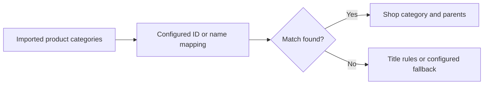

# Project overview

Icecat Category Mapper is a WordPress/WooCommerce plugin that translates imported
Icecat categories into a shop's own category structure. The source and changelog
are public; this overview does not certify a particular shop or import provider.

## Walkthrough with synthetic products

1. On a staging shop, create a WooCommerce category called **Demo keyboards**.
2. Open **WooCommerce → Icecat Mapper** and map Icecat **Keyboards** to it.
3. Create a draft product called **Demo USB keyboard** and assign its imported
   source category **Keyboards**.
4. Save the draft and inspect its categories and the mapper log. A configured
   match should replace the source category with **Demo keyboards**.
5. Try an unmapped category and inspect the configured fallback. Keep the example
   product in draft while deciding how unmatched imports should be handled.

This is a documented example, not a captured runtime demo. The repository's
[staging contract](../tests/mapper-contract.php) creates temporary fixtures and
checks matching, title rules and parent-category protection. Its existence is
not evidence that it has passed on your site.

[Installation and requirements](../README.md#installation) ·
[Changelog](../readme.txt) · [License](../LICENSE)
